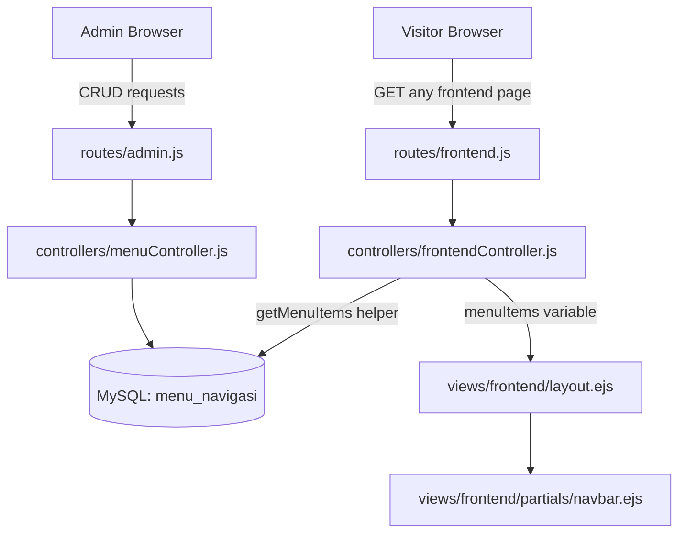

# Design Document: Dynamic Navbar Menu

## Overview

Fitur ini menggantikan navbar statis yang di-hardcode di `views/frontend/partials/navbar.ejs` dengan navbar dinamis yang diambil dari database. Admin dapat mengelola menu navigasi (tambah, edit, hapus, toggle status) melalui panel admin di `/admin/menu`. Frontend controller akan menyediakan data menu ke semua halaman frontend melalui helper function terpusat.

Stack: Node.js + Express + EJS + MySQL + Bootstrap 5. Tidak ada perubahan pada dependency — fitur ini murni menggunakan stack yang sudah ada.

## Architecture



Alur data:
1. Setiap request ke frontend route memanggil helper `getMenuItems()` di frontendController
2. Helper query `menu_navigasi` untuk item aktif, diurutkan by `urutan ASC`
3. Data dikembalikan sebagai array terstruktur (parent + children) dan di-pass ke view sebagai `menuItems`
4. Navbar partial merender menu secara dinamis — dropdown jika ada sub-menu aktif, plain link jika tidak

## Components and Interfaces

### 1. Database Migration Script
**File:** `create_menu_navigasi_table.js`

Membuat tabel `menu_navigasi` dan seed data default. Dijalankan sekali saat setup.

### 2. Menu Controller
**File:** `controllers/menuController.js`

| Method | Route | Deskripsi |
|--------|-------|-----------|
| `index` | GET /admin/menu | Daftar semua menu (hierarki) |
| `createPage` | GET /admin/menu/create | Form tambah menu |
| `create` | POST /admin/menu/create | Proses tambah menu |
| `editPage` | GET /admin/menu/edit/:id | Form edit menu |
| `update` | POST /admin/menu/edit/:id | Proses update menu |
| `delete` | POST /admin/menu/delete/:id | Hapus menu (cascade) |
| `toggleStatus` | POST /admin/menu/toggle/:id | Toggle aktif/nonaktif |

### 3. Frontend Controller Helper
**File:** `controllers/frontendController.js` (modifikasi)

Tambah helper function `getMenuItems()` yang dipanggil di setiap controller method:

```javascript
const getMenuItems = async () => {
  try {
    const [rows] = await db.query(
      `SELECT * FROM menu_navigasi WHERE status = 'aktif' ORDER BY urutan ASC`
    );
    // Susun hierarki: parent dengan children array
    const parents = rows.filter(r => r.parent_id === null);
    parents.forEach(p => {
      p.children = rows.filter(r => r.parent_id === p.id);
    });
    return parents;
  } catch (err) {
    console.error('Error loading menu:', err);
    return []; // fallback graceful
  }
};
```

Setiap controller method menambahkan `menuItems` ke object yang di-pass ke `res.render()`.

### 4. Admin Views
**Directory:** `views/admin/menu/`

- `index.ejs` — tabel daftar menu dengan hierarki visual, tombol aksi
- `create.ejs` — form tambah menu
- `edit.ejs` — form edit menu

### 5. Frontend Navbar Partial
**File:** `views/frontend/partials/navbar.ejs` (modifikasi)

Navbar dirender dinamis dari `menuItems`. Logika rendering:
- Jika menu punya `children.length > 0` → render sebagai Bootstrap 5 dropdown
- Jika tidak → render sebagai `<a>` biasa
- Jika `icon` tidak null → tampilkan `<i class="[icon]">` sebelum label
- Jika `target === '_blank'` → tambahkan `target="_blank" rel="noopener noreferrer"`

## Data Models

### Tabel `menu_navigasi`

```sql
CREATE TABLE menu_navigasi (
  id          INT AUTO_INCREMENT PRIMARY KEY,
  label       VARCHAR(100) NOT NULL,
  url         VARCHAR(255) NOT NULL,
  parent_id   INT NULL,
  urutan      INT NOT NULL DEFAULT 0,
  status      ENUM('aktif', 'nonaktif') NOT NULL DEFAULT 'aktif',
  icon        VARCHAR(100) NULL,
  target      ENUM('_self', '_blank') NOT NULL DEFAULT '_self',
  created_at  TIMESTAMP DEFAULT CURRENT_TIMESTAMP,
  FOREIGN KEY (parent_id) REFERENCES menu_navigasi(id) ON DELETE CASCADE
);
```

Constraint penting:
- `ON DELETE CASCADE` pada `parent_id` — menghapus parent otomatis menghapus semua sub-menu
- `status` ENUM membatasi nilai hanya 'aktif' atau 'nonaktif'
- `target` ENUM membatasi nilai hanya '_self' atau '_blank'
- `label` dan `url` NOT NULL

### Struktur Data di Memory (setelah query)

```javascript
// Array menuItems yang di-pass ke view
[
  {
    id: 1, label: 'Beranda', url: '/', parent_id: null,
    urutan: 1, status: 'aktif', icon: null, target: '_self',
    children: []
  },
  {
    id: 2, label: 'Profil', url: '/profil', parent_id: null,
    urutan: 2, status: 'aktif', icon: null, target: '_self',
    children: [
      { id: 5, label: 'Visi & Misi', url: '/profil/visi-misi', parent_id: 2, ... },
      { id: 6, label: 'Sejarah Sekolah', url: '/profil/sejarah', parent_id: 2, ... }
    ]
  }
]
```

## Correctness Properties

*A property is a characteristic or behavior that should hold true across all valid executions of a system — essentially, a formal statement about what the system should do. Properties serve as the bridge between human-readable specifications and machine-verifiable correctness guarantees.*

### Property 1: Validasi label dan URL wajib diisi

*For any* string yang kosong atau hanya terdiri dari whitespace yang digunakan sebagai `label` atau `url` pada operasi create maupun update, sistem SHALL menolak penyimpanan dan jumlah record di database tidak berubah.

**Validates: Requirements 1.2, 1.3, 2.2, 2.3, 3.2, 3.3**

### Property 2: Cascade delete sub-menu

*For any* parent menu yang memiliki satu atau lebih sub-menu, ketika parent dihapus maka semua sub-menu dengan `parent_id` yang merujuk ke parent tersebut SHALL ikut terhapus dari database.

**Validates: Requirements 4.1**

### Property 3: Toggle status round-trip

*For any* menu item dengan status apapun, melakukan toggle status dua kali berturut-turut SHALL mengembalikan status ke nilai semula.

**Validates: Requirements 5.1**

### Property 4: Status filtering di getMenuItems

*For any* konfigurasi database yang mengandung campuran menu aktif dan nonaktif (baik parent maupun sub-menu), hasil `getMenuItems()` SHALL hanya mengandung parent dengan status 'aktif' dan setiap array `children` SHALL hanya mengandung sub-menu dengan status 'aktif'.

**Validates: Requirements 5.2, 5.3, 7.1**

### Property 5: Urutan menu konsisten

*For any* kumpulan menu aktif dengan nilai `urutan` yang bervariasi, urutan kemunculan item dalam array hasil `getMenuItems()` SHALL selalu mengikuti nilai `urutan` secara ascending.

**Validates: Requirements 6.1, 7.1**

### Property 6: Rendering navbar berdasarkan children

*For any* array `menuItems`, item yang memiliki `children.length > 0` SHALL dirender sebagai Bootstrap 5 dropdown, sedangkan item dengan `children.length === 0` SHALL dirender sebagai plain `<a>` link.

**Validates: Requirements 7.2, 7.4**

### Property 7: Atribut target dan icon di HTML output

*For any* menu item dengan `target = '_blank'`, output HTML SHALL mengandung atribut `target="_blank"` dan `rel="noopener noreferrer"`. *For any* menu item dengan nilai `icon` tidak null, output HTML SHALL mengandung elemen `<i>` dengan class yang sesuai sebelum label.

**Validates: Requirements 7.5, 7.6**

### Property 8: Fallback graceful saat error atau data kosong

*For any* kondisi di mana query database gagal atau tidak ada menu aktif, `getMenuItems()` SHALL mengembalikan array kosong `[]` tanpa melempar exception, dan halaman frontend SHALL tetap ter-render tanpa error.

**Validates: Requirements 7.7, 8.2**

### Property 9: menuItems selalu tersedia di semua view frontend

*For any* frontend route yang di-render, object yang di-pass ke `res.render()` SHALL selalu mengandung key `menuItems` dengan nilai bertipe array.

**Validates: Requirements 8.3**

## Error Handling

| Skenario | Penanganan |
|----------|-----------|
| Edit/hapus menu dengan id tidak ada | Redirect ke `/admin/menu` dengan query `?error=not_found` |
| Validasi label/URL kosong | Re-render form dengan pesan error, tidak menyimpan ke DB |
| Database error saat load menu frontend | `getMenuItems()` catch → return `[]`, log error, halaman tetap render |
| Database error di admin controller | Redirect dengan `?error=1` atau render error message |
| Hapus parent dengan sub-menu | Ditangani otomatis oleh `ON DELETE CASCADE` di MySQL |

## Testing Strategy

### Unit Tests

Fokus pada contoh spesifik dan edge case:
- Validasi: label kosong, URL kosong, label > 100 karakter, URL > 255 karakter
- `getMenuItems()` mengembalikan `[]` saat DB error (mock db.query throw error)
- Rendering navbar: menu tanpa children → plain link, menu dengan children → dropdown
- Menu dengan `target='_blank'` → atribut `target` dan `rel` ada di output HTML
- Menu dengan `icon` → elemen `<i>` ada di output

### Property-Based Tests

Menggunakan library **fast-check** (tersedia di npm, cocok untuk Node.js).

Setiap property test dikonfigurasi minimum **100 iterasi**.

Tag format: `Feature: dynamic-navbar-menu, Property {N}: {deskripsi}`

**Property 1 — Label/URL validation:**
```
// Feature: dynamic-navbar-menu, Property 1: Label dan URL wajib diisi
// Generate random empty/whitespace strings sebagai label atau URL
// Assert: create/update menolak dan DB count tidak berubah
```

**Property 2 — Cascade delete:**
```
// Feature: dynamic-navbar-menu, Property 2: Cascade delete sub-menu
// Generate random parent dengan N sub-menu
// Delete parent → assert semua sub-menu ikut terhapus
```

**Property 3 — Toggle round-trip:**
```
// Feature: dynamic-navbar-menu, Property 3: Toggle status round-trip
// Generate menu dengan status random
// Toggle dua kali → assert status sama dengan awal
```

**Property 4 & 5 — Status filtering:**
```
// Feature: dynamic-navbar-menu, Property 4 & 5: Status filtering
// Generate campuran menu aktif/nonaktif
// Assert: getMenuItems() hanya mengembalikan yang aktif, children hanya yang aktif
```

**Property 6 — Urutan konsisten:**
```
// Feature: dynamic-navbar-menu, Property 6: Urutan menu konsisten
// Generate menu dengan urutan random
// Assert: hasil getMenuItems() selalu terurut ascending by urutan
```

**Property 7 — Fallback error:**
```
// Feature: dynamic-navbar-menu, Property 7: Fallback menu kosong saat error
// Mock db.query untuk throw error
// Assert: getMenuItems() return [] tanpa throw
```

**Property 8 — menuItems di semua view:**
```
// Feature: dynamic-navbar-menu, Property 8: menuItems selalu tersedia
// Untuk setiap frontend route, assert res.render dipanggil dengan menuItems array
```
